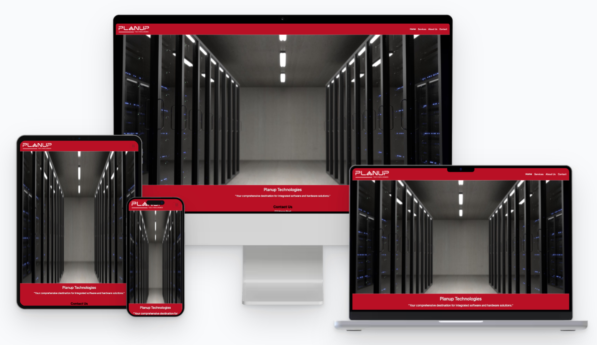

# Planup Technologies

## Welcome to Planup Technologies GitHub Repository

## About Us

Planup Technologies specializes in providing comprehensive technology solutions tailored for small businesses. We offer a wide range of services to enhance operational efficiency, streamline processes, and support growth.

## Our Services

1. **Accounting Software**

   - Tailored solutions for small businesses to manage finances, invoicing, payroll, and tax preparation.

2. **Customer Relationship Management (CRM) Software**

   - Tools to manage customer interactions, track leads, and improve sales and marketing efforts.

3. **Website Development and Hosting**

   - Professional website development and hosting, including e-commerce solutions for online sales.

4. **Inventory Management Software**

   - Solutions to track and manage stock levels, orders, and suppliers efficiently.

5. **Point of Sale (POS) Systems**

   - Systems for retail businesses to process transactions, manage sales, and track inventory in-store or online.

6. **Security and Surveillance Systems**

   - Installation of security cameras and surveillance systems to monitor premises and deter theft or vandalism.

7. **Cloud Storage and Backup Services**

   - Secure cloud storage and backup solutions for business data, including files, documents, and customer information.

8. **IT Support and Maintenance**

   - Comprehensive IT support services to set up, maintain hardware/software, troubleshoot technical issues, and ensure data security.

9. **Telecommunication Services**

   - VoIP phone systems, video conferencing solutions, and internet connectivity to keep businesses connected.

10. **Digital Marketing Services**

    - SEO, social media management, and email marketing services to promote products and services online.

11. **Hardware Upgrades and Maintenance**

    - Services for upgrading and maintaining computers, servers, networking equipment, and IT infrastructure.

12. **Training and Education Programs**
    - Programs to improve digital literacy and effective use of software and hardware tools.

## Contact Us

For inquiries about our services or collaboration opportunities, please contact us at:

- Email: [info@planuptechnologies.com ](mailto:info@planuptechnologies.com)
- Phone: [+91-0495-4602338]

Visit our website [www.companywebsite.com](https://planuptechnologies.com/) for more information.

---

### Usage

This repository may include:

- Sample code snippets
- Configuration files
- Setup instructions

Please refer to individual directories or files for specific details.

### License

This repository is licensed under the Planup Technologies Copyright2024.

### Contributing

We welcome contributions to improve our services and resources. Feel free to submit issues or pull requests.
